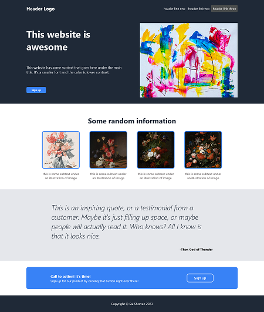

# Landing Page: Odin Project

This is a landing page created as part of [the odin project curriculum](https://www.theodinproject.com/lessons/foundations-landing-page). It features various sections including a header, hero section, information section, quote section, call to action section, and footer.



## Technologies Used

- HTML
- CSS

## Getting Started

1. Clone the repository:

   ```bash
   git clone https://github.com/your-username/landing-page-odin.git
   ```

2. Open the `index.html` file in your web browser.

## Structure

The project has the following structure:

- `index.html`: The main HTML file containing the structure of the landing page.
- `styles.css`: The CSS file containing the styles for the landing page.

## Customization

You can customize the landing page by modifying the HTML and CSS files. Feel free to update the text content, images, colors, and layout to match your desired design.

## Credits

- Images used in the hero section and information section are from [Unsplash](https://unsplash.com/).
- Quote by Thor, God of Thunder 😋.

## License

This project is licensed under the [MIT License](LICENSE).
